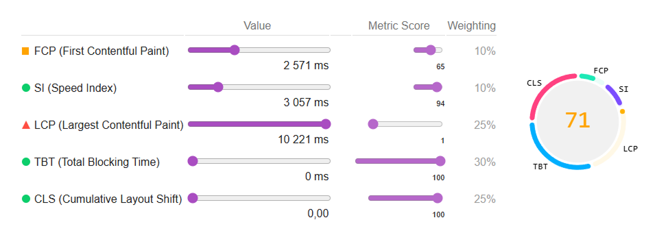
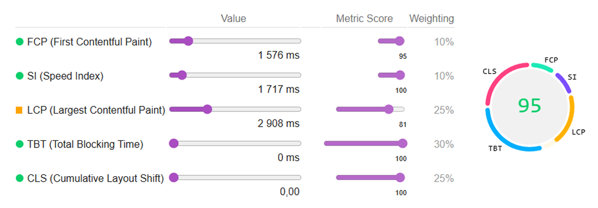

# IG Green — Sustainable Energy Investment Website

IG Green is a modern, performance-focused corporate website for a sustainable energy investment platform. The project is built with a strong emphasis on semantic HTML, accessibility (a11y), SEO-friendly structure, and Lighthouse performance optimization.

🔗 [**Live Demo**](https://ig-green.spekter.solutions)  

---

## Key Focus Areas

### Semantic & accessible markup

- Proper use of landmarks (header, nav, main, section, footer)
- ARIA attributes for navigation, controls, and decorative elements
- Keyboard-friendly mobile navigation and focus handling

### Performance optimization

- LCP optimization (Largest Contentful Paint)
- Responsive images using picture, srcset, and sizes
- Correct use of fetchpriority, loading, and decoding
- Elimination of render-blocking and oversized assets

### SEO-ready structure

- Clean heading hierarchy (h1–h3)
- Meaningful section grouping and readable content flow
- Index-friendly image handling (no critical content in CSS backgrounds)

### Modern front-end practices

- Mobile-first responsive layout
- CSS animations optimized for performance
- JavaScript used only where necessary (menu interactions, UI states)
- No frameworks — pure HTML, CSS, and vanilla JS

---

## Tech Stack

- **HTML5** — semantic, standards-compliant markup
- **CSS3 / SCSS** — responsive layout, animations, media queries
- **JavaScript (Vanilla)** — lightweight UI interactions
- **WebP / WebM** — optimized image delivery
- **Lighthouse-driven optimization** — performance, accessibility, SEO

---

## Project Structure

```  
public/
├── assets/
│   ├── css/
│   ├── img/
│   ├── js/
│   └── scss/
│       ├── components/
│       ├── sections/
│       ├── _outline.scss
│       ├── _scrollbar.scss
│       ├── _sections.scss
│       └── style.scss
│
├── templates/
├── index.html
├── robots.txt
└── site.webmanifest

```

---

## Lighthouse Performance

Performance optimization was carried out as part of the front-end delivery process.

---

## 📊 Lighthouse Metrics — Before → After Optimization Main Page

| Metric            | Before                                   | After                                    | Improvement |
|-------------------|-------------------------------------------|-------------------------------------------|-------------|
| **Performance**   |   |   | ↑ +9        |
| **Accessibility** |  |  | ↑ +25       |
| **Best Practices**|  |  | —          |
| **SEO**           |  |  | —         |


### 🖼 Before / After 

|  |  |
|:--:|:--:|
| **Before** | **After** |

---

### 🎯 JSON reports
- [Before JSON](./media/json/before.json)
- [After JSON](./media/json/after.json)